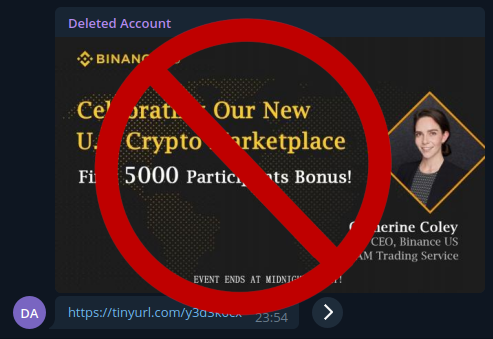

[![Build status on GitLab CI][gitlab-ci-master-badge]][gitlab-ci-link]
[![Project license][crate-license-badge]](LICENSE)

[gitlab-ci-link]: https://gitlab.com/timvisee/ban-binance-bot/pipelines
[gitlab-ci-master-badge]: https://gitlab.com/timvisee/ban-binance-bot/badges/master/pipeline.svg

# Ban Binance Bot for Telegram [WIP]
A Telegram bot to ban users advertising Binance promotions.

Public Telegram channels are infested with Binance spam these days, posted by
bots at random intervals. This bot counters this by scanning all images, files
and links posted in group chats. If any content related to these Binance
promotions is posted, the user is instantly banned and their message is removed.

## How does it work?
When the bot is added to a group, all content is scanned for Binance promotions.

The bot currently scans for:
- links going to Binance promotions
- pictures containing a Binance promotion

When illegal content is found:
- the user is immediately banned from the chat
- the respective message is deleted
- users are notified in the group chat

No configuration needed, this bot works out of the box. Remove the bot from the
group once you're done with it.

Messages of administrators may be deleted, but administrators are never banned.

## How to use?
I host a public instance of this bot which you can use in your own groups.

1.  Directly message [@banbinancebot](https://t.me/banbinancebot) in Telegram,
    make sure the bot responds to verify it still running.
2.  Add [@banbinancebot](https://t.me/banbinancebot) to any of your Telegram
    groups.
3.  Make [@banbinancebot](https://t.me/banbinancebot) administrator, to support
    automatic banning.
    - In normal groups; disable 'All Members Are Admins', mark the bot as administrator
    - In supergroups; mark the bot as administrator

You can always compile this bot yourself, to host your own instance.

### Privacy statement
Once added to a group, this bot scans all following user messages to determine
whether illegal content is posted. All links are visited to determine whether
the link to any Binance related content. All files (photos, GIFs, ...) are
downloaded and scanned for Binance content, and are immediately deleted from
disk afterwards. This is an automated process with no user intervention.

## License
This project is licensed under the GNU GPL-3.0 license.
Check out the [LICENSE](LICENSE) file for more information.
